# EDP_TECH

A comprehensive IT Operations & Service Management Platform designed to centralize and streamline the support operations of LSP company across all branches and departments. The system bridges the gap between end-users and the IT technical team through a robust suite of integrated features.

## Project Structure
---

# System Screenshots

## Login

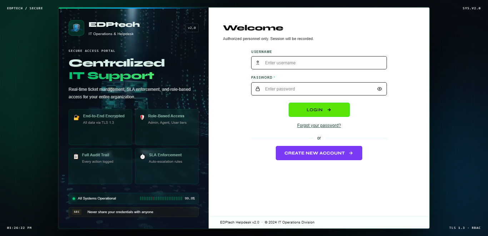

## Signup

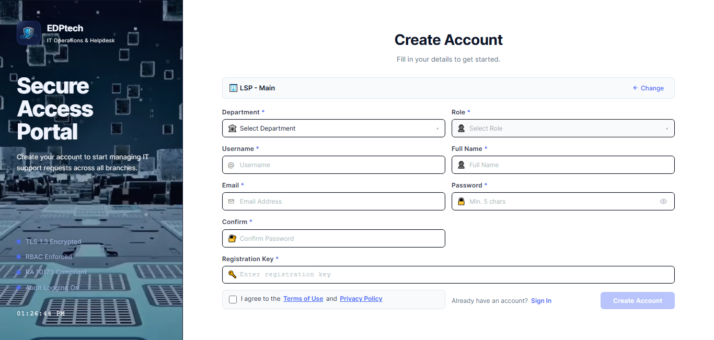

## Client Dashboard

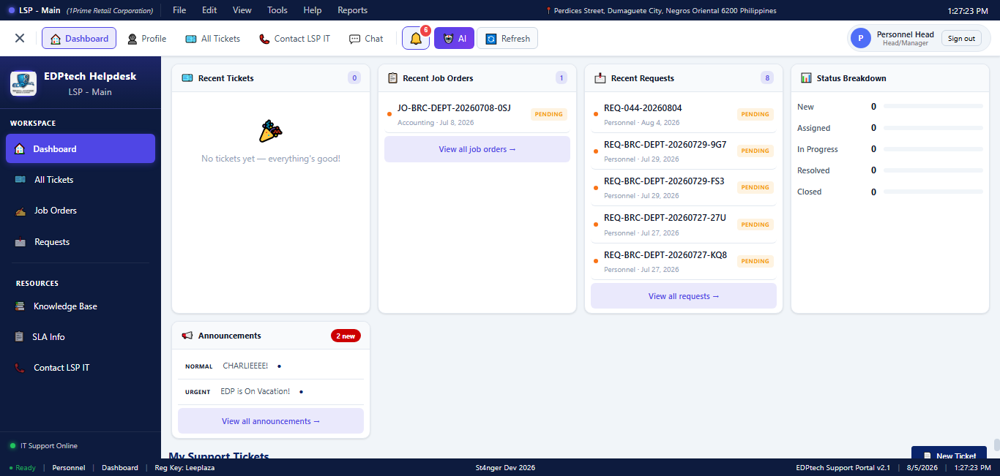

## Client Ticket Management

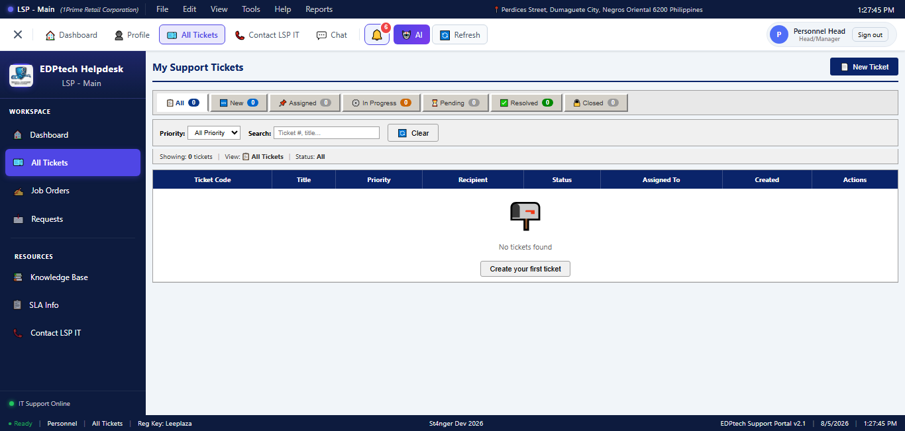

## Screenshot 5


## CLient Job Order Management

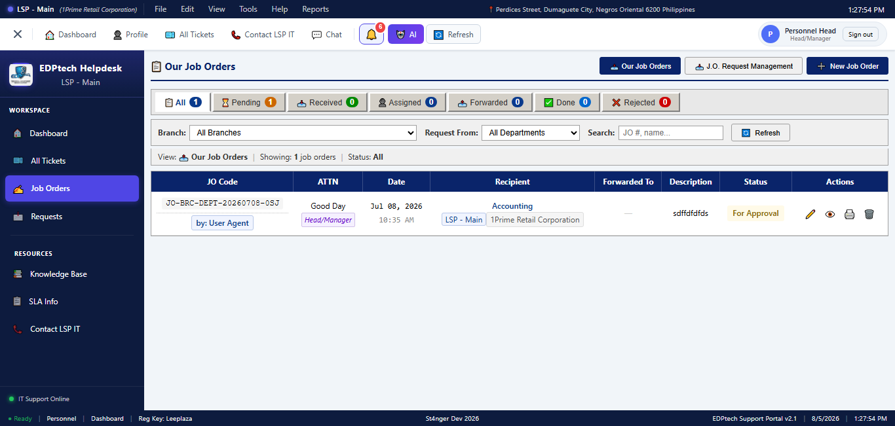

## Screenshot 7

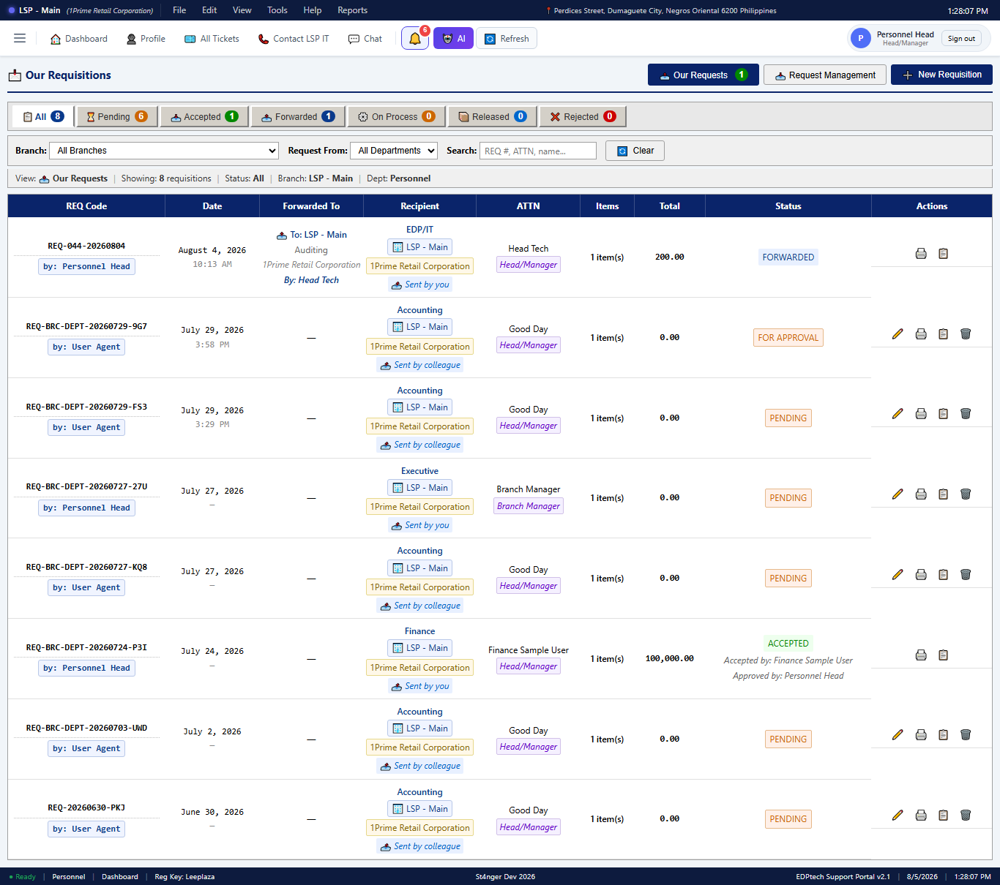

## Client Chat Interface 

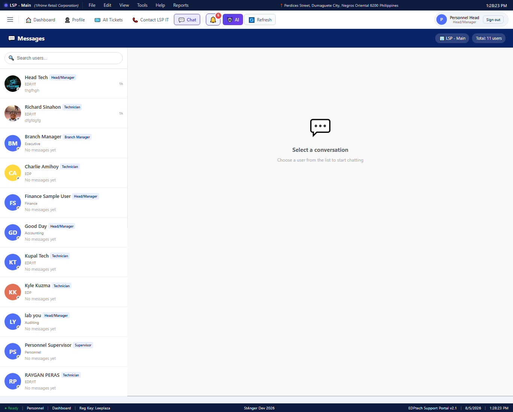

## Client Profile Interface

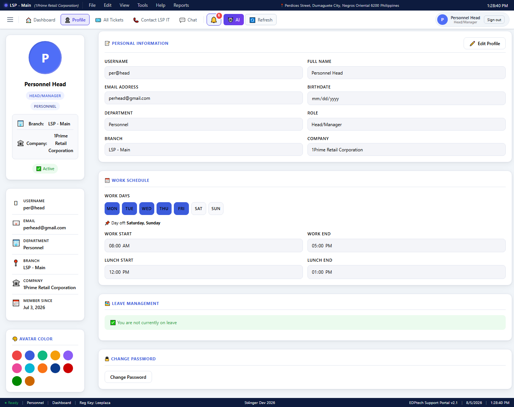

## Create Tickets Form

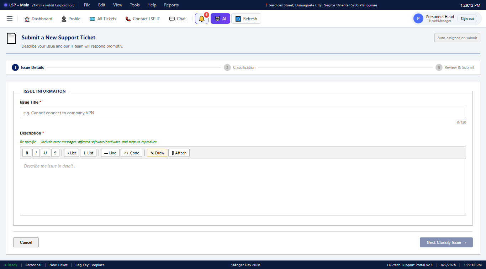

## Admin side Dashboard

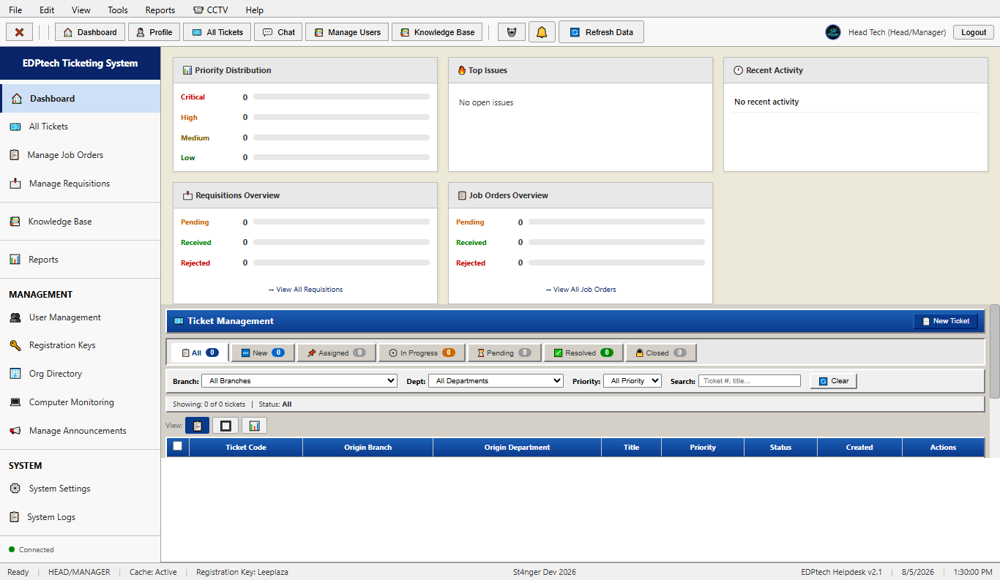

## Admin Ticket Management

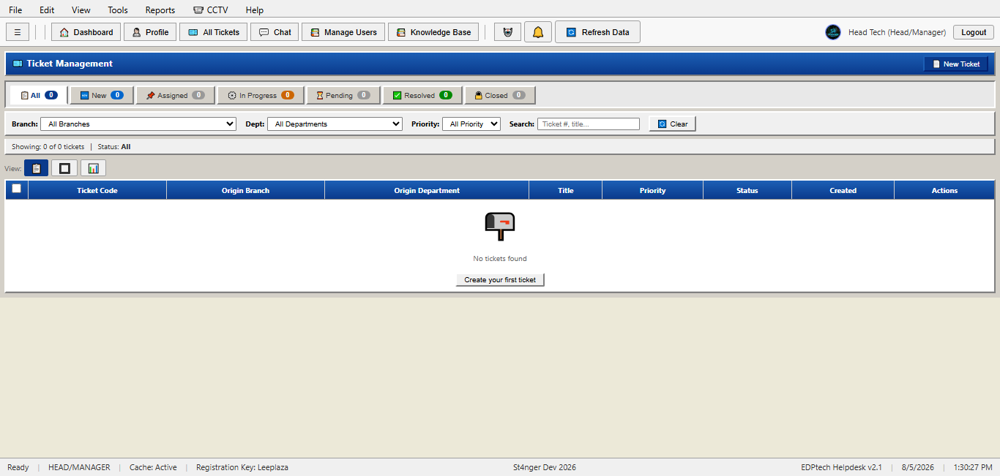

## Admin Job Order Management

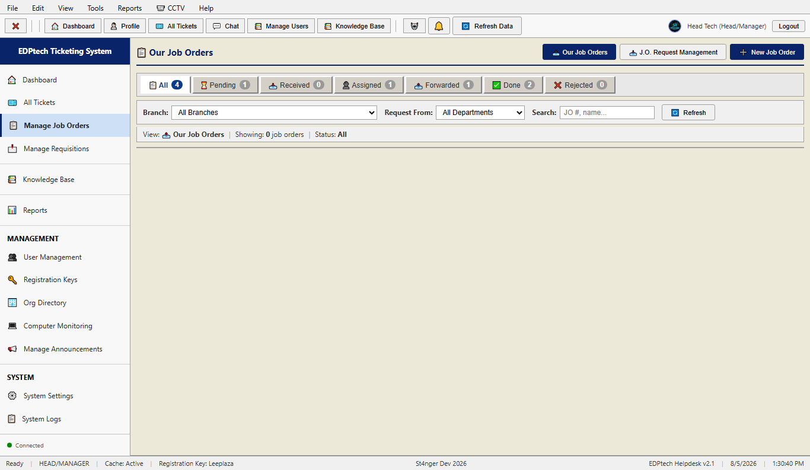

## Admin Requisition Management

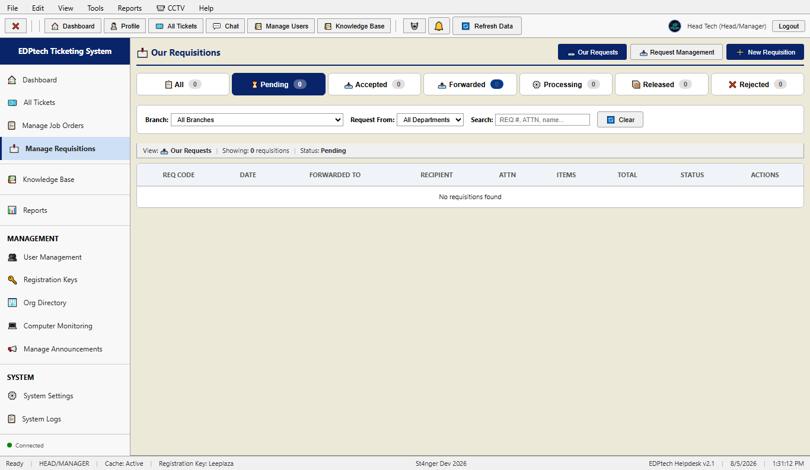

## Admin User Management 

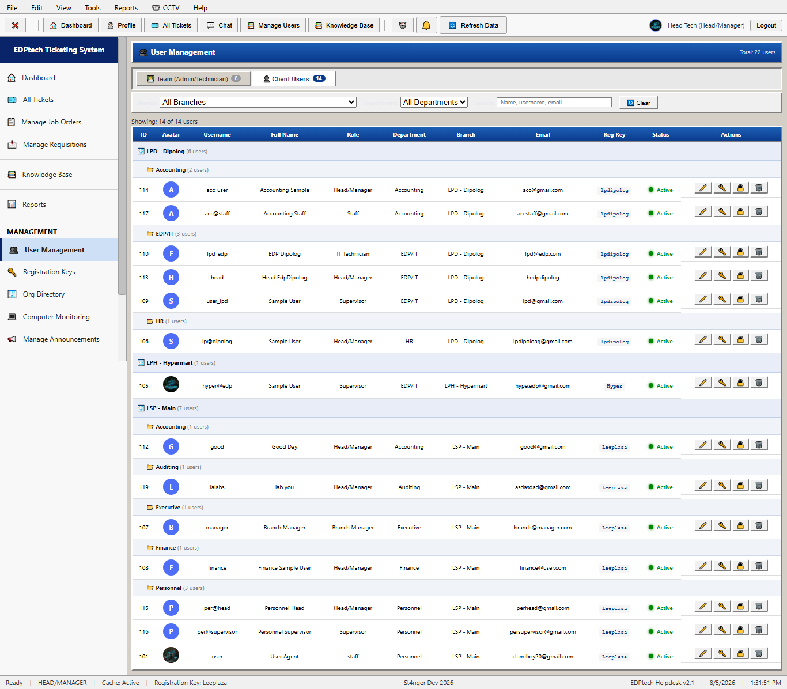

## Admin Org Directory

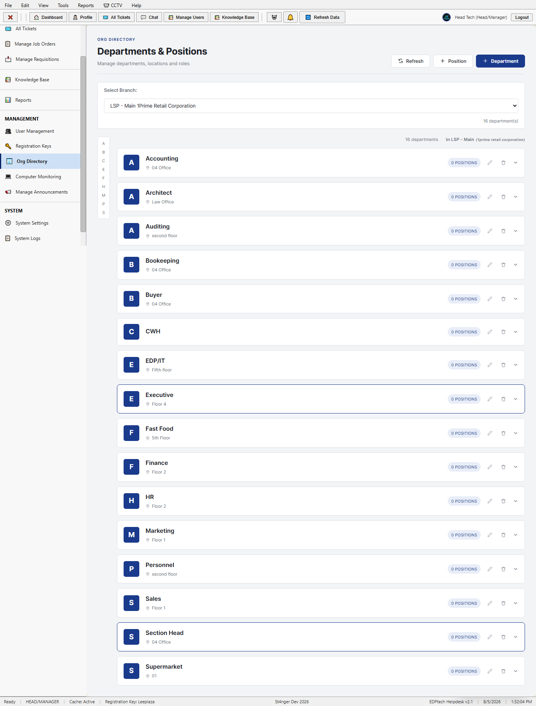

## System Settings

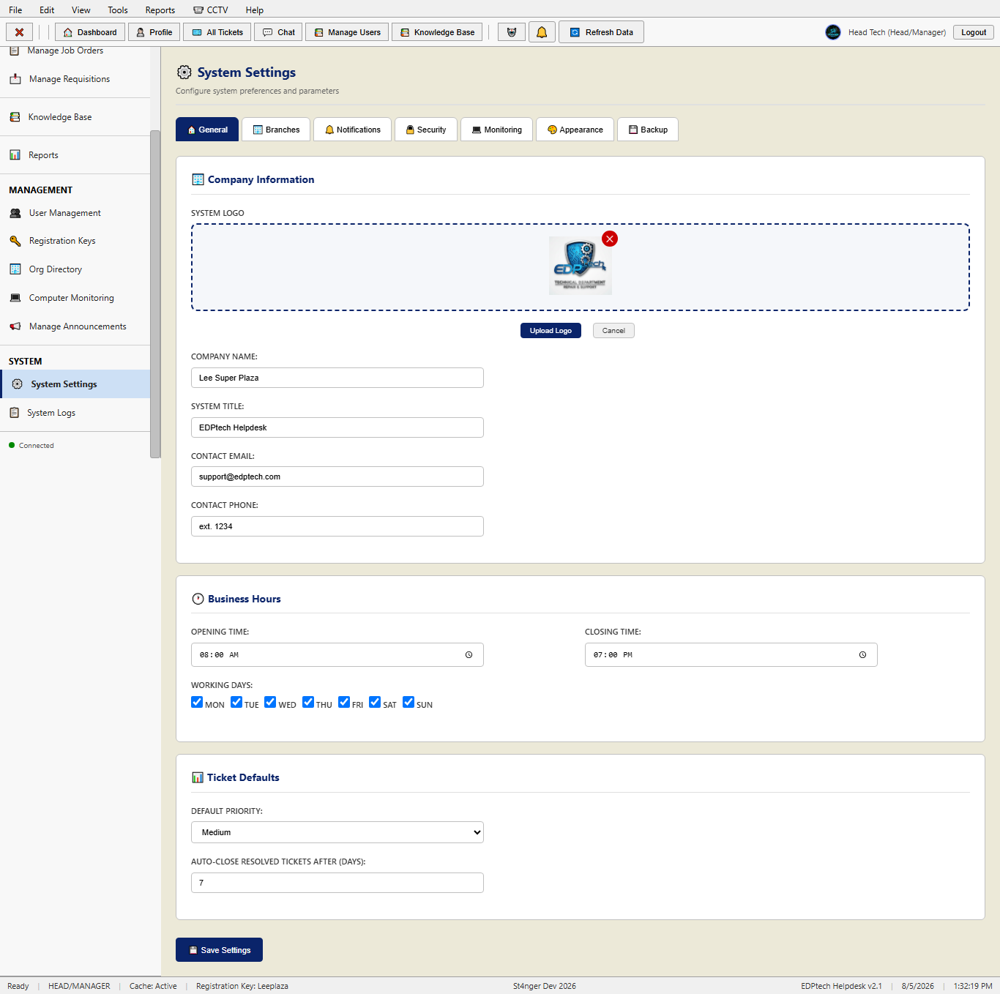
```text
EDP_TECH/
├── edptech-helpdesk/     # Angular Frontend
├── edptech-backend/      # Python Backend
├── db backup/            # Database Backups
├── Config for database to open in component.txt
└── User Credential.txt
```

## Frontend - EdptechHelpdesk

This project was generated using Angular CLI version 21.2.7.

### Development Server

Start a local development server:

```bash
cd edptech-helpdesk
ng serve
```

Open your browser and navigate to:

```text
http://localhost:4200/
```

The application will automatically reload whenever source files are modified.

### Code Scaffolding

Generate a new component:

```bash
ng generate component component-name
```

View available schematics:

```bash
ng generate --help
```

### Building

Build the Angular application:

```bash
ng build
```

Build artifacts will be stored in:

```text
dist/
```

### Unit Testing

Run unit tests:

```bash
ng test
```

### End-to-End Testing

Run e2e tests:

```bash
ng e2e
```

Angular CLI does not provide an end-to-end framework by default.

---

## Backend

The backend application is located in:

```text
edptech-backend/
```

Install dependencies and configure the environment as needed.

---

## Additional Resources

Angular CLI Documentation:

https://angular.dev/tools/cli

GitHub Repository:

https://github.com/camihoy96/EDP_TECH
